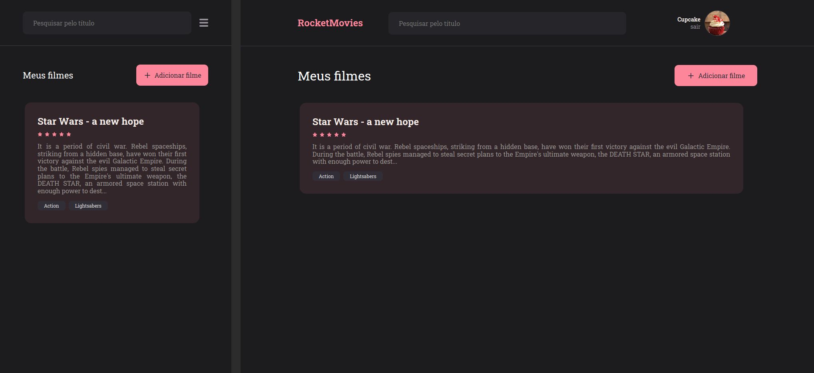

# RocketMovies

- An application that allows people to create notes about movies, give rates and add genre tags.
- The user can create an account, login/logout, and see/edit all notes created.

## Technologies

- React with Typescript
- Styled Components
- CSS
- [React-hot-toast](https://react-hot-toast.com/)
- [React-modal](http://reactcommunity.org/react-modal/)
- [React-burger-menu](http://negomi.github.io/react-burger-menu/)

---

Project made with 💜 during the Rocketseat's Explorer bootcamp
